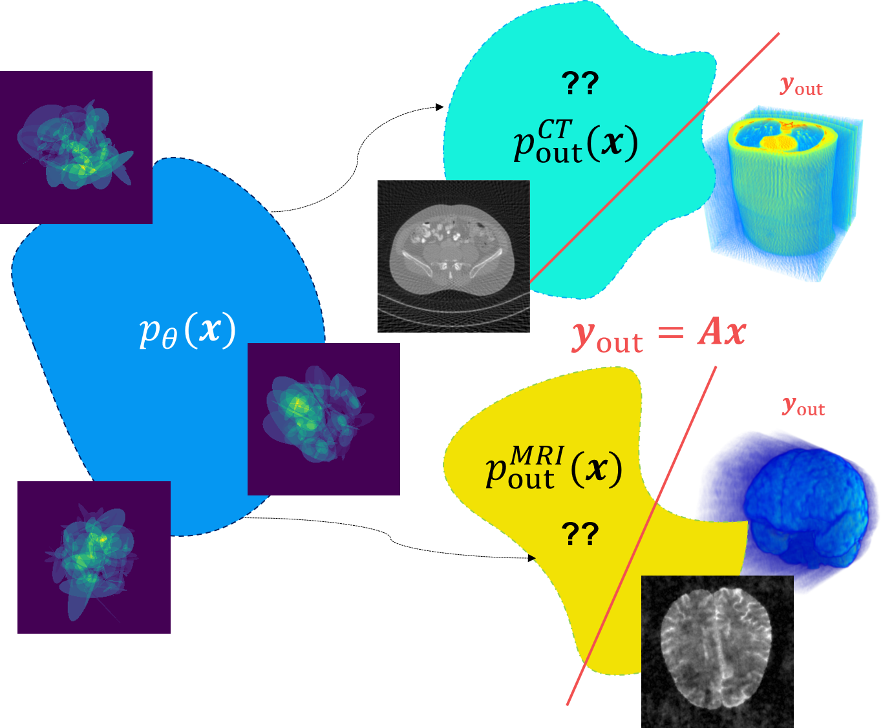
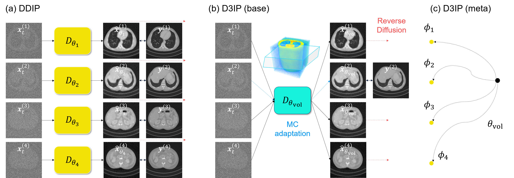
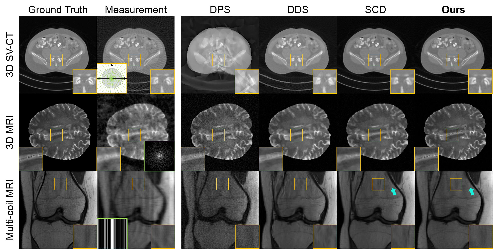

# Deep Diffusion Image Prior for Efficient OOD Adaptation in 3D Inverse Problems

[Hyungjin Chung](https://www.hj-chung.com/) and [Jong Chul Ye](https://bispl.weebly.com/professor.html)  

Official PyTorch implementation for **Deep Diffusion Image Prior (DDIP)**, presented in the paper [v](https://arxiv.org/abs/2303.05754).




## Getting Started

### Download pre-trained modei weights

```
# Download pre-trained model weights
mkdir -p './exp/vp'
wget -O './exp/vp/ellipses_ema.pth' 'https://www.dropbox.com/scl/fi/g2yd0ecpboz3vc8iwc530/ellipses_ema.pt?rlkey=i1yff5lj2ynk6of0uywqxnqyv&st=smhuffir&dl=1'
wget -O './exp/vp/fastmri_brain_320_complex_1m.pth' 'https://www.dropbox.com/scl/fi/febne0udjvq0cphbggrmy/fastmri_brain_320_complex_1m.pt?rlkey=k4e8tk21ueqjslsw17b05sbho&st=tain0kew&dl=1'
```

### Download sample test data

```
# Download sample test data
mkdir -p './data'
wget -O './data/data.zip' 'https://www.dropbox.com/scl/fo/wqgpu59c1ge5gw6uwgldw/AHkRLVMkeyr-Odo4CbNtRYI?rlkey=mo6dcglz9pcsjinvgjvby5bm7&st=6n9okudo&dl=1'
# Extract zip file
unzip -q ./data/data.zip -d ./data
```

By default, the above scripts places the pre-trained model checkpoints under ```exp/vp```, and the sample data under ```data```.

## Inverse Problem Solving

Each experiment in the paper can be reproduced by simply running the scripts in ```./scripts```. All scripts will run by going through the ```main.py``` file.

## Citation
If you find our work interesting, please consider citing

```
@article{chung2024deep,
  title={Deep Diffusion Image Prior for Efficient OOD Adaptation in 3D Inverse Problems},
  author={Chung, Hyungjin and Ye, Jong Chul},
  journal={arXiv preprint arXiv:????.?????},
  year={2024}
}
```